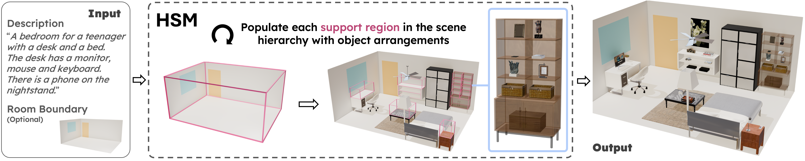

# HSM: Hierarchical Scene Motifs for Multi-Scale Indoor Scene Generation

[](https://3dlg-hcvc.github.io/hsm/)
[](https://arxiv.org/abs/2503.16848)

[Hou In Derek Pun](https://houip.github.io/), [Hou In Ivan Tam](https://iv-t.github.io/), [Austin T. Wang](https://atwang16.github.io/), [Xiaoliang Huo](), [Angel X. Chang](https://angelxuanchang.github.io/), [Manolis Savva](https://msavva.github.io/)



This repo contains the official implementation of Hierarchical Scene Motifs (HSM), a hierarchical framework for generating realistic indoor environments in a unified manner across scales using scene motifs.

## Environment Setup
The repo is tested on Ubuntu 22.04 LTS with `Python 3.11` and `CUDA 12.1`.

### Automated Setup (Recommended)

1. **Acknowledge license to access HSSD on [Hugging Face](https://huggingface.co/datasets/hssd/hssd-models)**

2. **Set up environment variables:**
   ```bash
   # Copy the template and edit it
   cp .env.example .env

   # Edit the .env file with your API keys
   vim .env  # or use your preferred editor
   ```

   You need to add:
   - [Your OpenAI API key](https://platform.openai.com/api-keys)
   - [Your Hugging Face access token](https://huggingface.co/settings/tokens)
   - (Optional) [Hugging Face SSH key](https://huggingface.co/settings/keys) for faster download

3. **Run the automated setup script:**
   ```bash
   ./setup.sh
   ```

This bash script handles all remaining setup steps including:
- Conda environment creation
- HSSD models downloads from Hugging Face
- Preprocessed data downloads from GitHub
- Verify file structure

### Manual Setup
<details>
<summary>Click to expand</summary>

1. Create a `.env` file in the root directory following the template in `.env.example` and add your OpenAI API key.

2. We use `mamba` (or `conda`) for environment setup:
    ```bash
    mamba env install -f environment.yml
    ```

#### Preprocessed Data
1. Visit the [HSM releases page](https://github.com/3dlg-hcvc/hsm/releases)
2. Download `data.zip` from the latest release
3. Unzip at `data/` at root

#### Assets for Retrieval
We retrieve 3D models from the [Habitat Synthetic Scenes Dataset (HSSD)](https://3dlg-hcvc.github.io/hssd/).

1.  **Download HSSD Models:**
    Accept the terms and conditions on Hugging Face [here](https://huggingface.co/datasets/hssd/hssd-models).
    Get your API token from [here](https://huggingface.co/settings/tokens).
    Then, clone the dataset repository (~72GB) under `data`:
    ```bash
    mkdir data && cd data
    hf auth login
    git lfs install
    git clone git@hf.co:datasets/hssd/hssd-models
    ```

2.  **Download Decomposed Models:**
    We also use decomposed models from HSSD, download it with the command below:
    ```bash
    hf download hssd/hssd-hab \
        --repo-type=dataset \
        --include "objects/decomposed/**/*_part_*.glb" \
        --exclude "objects/decomposed/**/*_part.*.glb" \
        --local-dir "data/hssd-models"
    ```

3.  **Download Support Surface Data:**
    1. Visit the [HSM releases page](https://github.com/3dlg-hcvc/hsm/releases)
    2. Download `support-surfaces.zip` from the latest release
    3. Unzip `support-surfaces.zip` and move it under `data/hssd-models/`


#### Directory Structure

**You should have the following file structure at the end:**
```
hsm/
|── data/
    ├── hssd-models/
    │   ├── objects/
            ├── decomposed/
    │   ├── support-surfaces/
    │   ├── ...
    |── motif_library/
        ├── meta_programs/
            ├── in_front_of.json
            ├── ...
    ├── preprocessed/
        ├── clip_hssd_embeddings_index.yaml
        ├── hssd_wnsynsetkey_index.json
        ├── clip_hssd_embeddings.npy
        ├── object_categories.json
```
</details>

## Usage

To generate a scene with a description, run the script below:

```bash
conda activate hsm
python main.py [options]
```

**Arguments:**

* `--help`: Show help message and all available arguments
* `-d <desc>`: Description to generate the room.
* `--output <dir>`: Directory to save the generated scenes (default: `results/single_run`)

**Example:**

```bash
python main.py -d "A small living room with a desk and a chair. The desk have a monitor and keyboard on top."
```

To change the parameters, you can edit the `configs/scene/scene_config.yaml` file.

## Output

The default result folder have the following structure:
```
results/
|── <timestamp_roomtype>/
    ├── scene_motifs/           # Scene motifs
    ├── visualizations/         # Viusalizations
    ├── room_scene.glb          # GLB file for debugging
    ├── scene.log               # Log for debugging
    ├── stk_scene_state.json    # SceneEval evaluation input
```

**Note**: Do not use the GLB file for evaluation, as the origin of the room geometry is misaligned.


## Evaluation

For evaluation, we use [SceneEval](https://3dlg-hcvc.github.io/SceneEval/) to evaluate the scene generation quality and generate visuals in the paper.

By default, `stk_scene_state.json` will be generated in the output folder and can be used for evaluation.

For more details, please refer to the [official SceneEval repo](https://github.com/3dlg-hcvc/SceneEval).


## Adding New Motif Types

To add new motif types, you need to:
1. Learn new motif types following the **Learn Meta-Program from Example** instructions in the [SMC repo](https://github.com/3dlg-hcvc/smc).
1. Add the learned meta-program from SMC to the `data/motif_library/meta_programs/` directory.
3. Update `configs/prompts/motif_types.yaml` by following the format in the `motifs` and `constraints` sections.


## Credits

This project would not be possible without the amazing projects below:
* [SceneMotifCoder](https://github.com/3dlg-hcvc/smc)
* [SceneEval](https://3dlg-hcvc.github.io/SceneEval/)
* [Libsg](https://github.com/smartscenes/libsg)
* [SSTK](https://github.com/smartscenes/sstk)
* [HSSD](https://3dlg-hcvc.github.io/hssd/)

If you use the HSM data or code, please cite:
```
@article{pun2025hsm,
    title = {{HSM}: Hierarchical Scene Motifs for Multi-Scale Indoor Scene Generation},
    author = {Pun, Hou In Derek and Tam, Hou In Ivan and Wang, Austin T. and Huo, Xiaoliang and Chang, Angel X. and Savva, Manolis},
    year = {2025},
    eprint = {2503.16848},
    archivePrefix = {arXiv}
}
```

## Acknowledgements
This work was funded in part by a CIFAR AI Chair, a Canada Research Chair, NSERC Discovery Grants, and enabled by support from the [Digital Research Alliance of Canada](https://alliancecan.ca/).
We also thank Jiayi Liu, Weikun Peng, and Qirui Wu for helpful discussions.